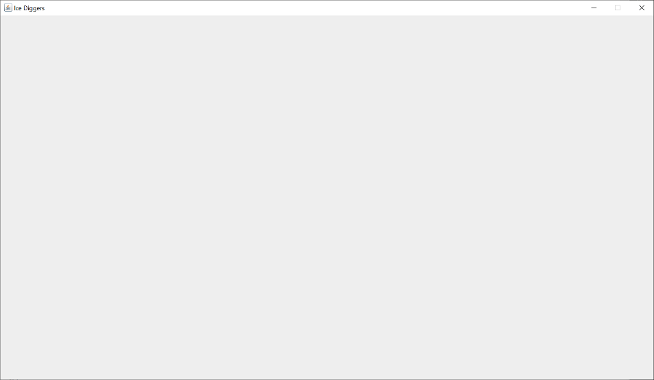
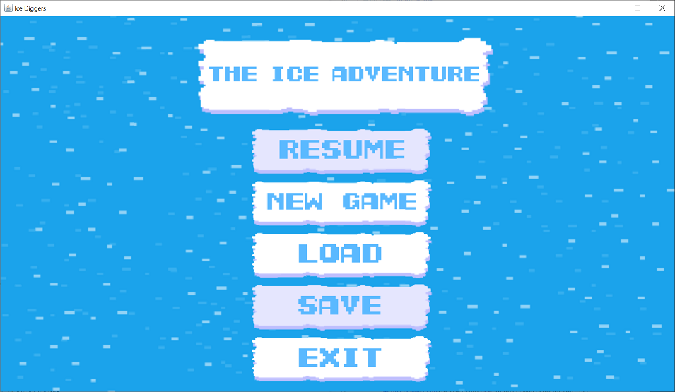

# Nem-funkcionális jellemzők vizsgálata

## A játék felület használhatósága

### Játék felhasználói felülete
- Ha a játékot lerakjuk, a tálcára vagy át az ablakot át mozgatjuk egy másik monitorra akkor a játék eltűnik és csak egy kattintás után lehet használni.

-  A játék ablakot nem lehet nem méretezhető ezért túl kicsi vagy túl nagy felbontásnál kényelmetlen a játék használata.

- Nincs lehetőség a régi mentések törlésére és nincs figyelmeztetés, amikor egy régi mentést írunk felűl.
- Nincs vizuális visszajelzés, amikor egy gombot lenyomunk
- A fő menüben a Resume és Save gomb megjeleni a játék kezdetekor, de semmi funkcionális jelentősége nincs, mivel nem lehet őket használni.

- Lehetséges a mentéseket más típusú fájl ként is elmenteni de ezek nem lehet látni azonnal a Load gomb lenyomásával csak ha a fájl keresőben a kereset fájl típust átállítjuk all-ra.
- A játék nem tartalmaz az automatikus mentés, ezért ha a játékmentés nélkül bezárunk, vagy a játék összeomlik, akkor a játék menetünk teljesen elveszik.
## Stresszteszt

## Teljesítménytesztek